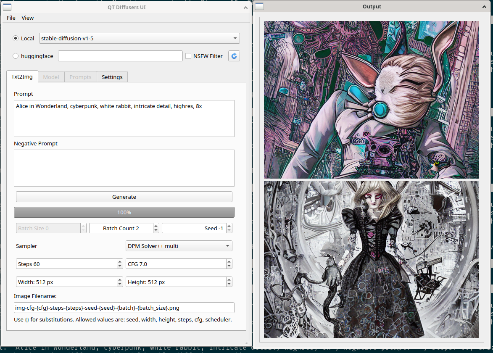

This is a QT 6 gui wrapping around the diffusers library, specifically using it for Stable Diffusion.

If you are looking at this, a few things you should know:
* The majority of this was initially hacked out in a few hours. It needs a lot of cleaning up.
* I am not actually very familiar with Python or using QT in Python, and I'm basically learning those as I'm going along. I am familiar with programming, just more with languages like C++ and Ruby.
* At the moment, this is a personal project. I probably won't be providing much support, though pr's are welcome.
* This is very much a work in progress. At the time I'm writing this, I'm already looking at splitting it into several files and cleaning it up, and some of the greyed out areas in the ui are more areas I'd like to implement things in then anything.
* Right now, this project **does not use ckpt or savetensor files**. It's using diffusers, and uses their format. If you go to a model on huggingface.co and do a git lfs clone, that folder is what it's looking for (in whatever model path you give it). It can also pull the model from there in remote mode. If you look over at https://github.com/huggingface/diffusers , it discusses pulling them. If you choose to get a remote model, there is very little error checking right now, and it'll crash if it times out. Hurray! I'll fix that eventually. It resumes from where it left off when you reopen.
* If things get really messed up, everything is saved in config.json at the moment, and you can delete it to regenerate.

Running this thing:
This is untested in windows. It'd probably work, but I'm only giving linux instructions, since that's all I've tested in. You'll need python and qt 6 installed.

if you run "sh setup.sh", it'll create a venv environment, activate it, and hopefully install all the preresequites. I'll probably make a requirements.txt file eventually.

You could, naturally, just type the commands in yourself.
```bash
python -m venv venv

source venv/bin/activate

pip install pyside6
pip install --upgrade diffusers[torch] transformers accelerate scipy safetensors
```

If you want to download a model, go to the model folder you want to use and run. for example:

```
git lfs install
git clone https://huggingface.co/hakurei/waifu-diffusion
```

You could also choose huggingface, and type (for example) "hakurei/waifu-diffusion". Also note that when you git clone a repository, it will pull any extraneous files in it as well. For example, if you git cloned "https://huggingface.co/runwayml/stable-diffusion-v1-5", you'll wind up with the folder, and **4 extra copies** of the model as well, downloading almost 24 extra GB of files. (waifu diffusion doesn't have any extra models in its folder, hence using that as an example.)

To actually launch the gui afterwards, type "sh launch.sh", or just activate the venv and run main.py.



You choose Local or Huggingface, and choose a model/type in a model, and can turn on and off the NSFW filter. There's a refresh button to rescan the model directory. If you go to settings, paths for models and images are there, defaulting to "model" and "images". the Txt2Img tab should be pretty straightforward. Put in a prompt, set your settings, put a filename in, hit generate, it generates an image, saves it, and displays it.

I'll probably be changing a fair amount of how the models work. I'm thinking about having both remote and local in the pulldown, and letting you add remote ones in a tab. I'd **like** to add a way to actually just use a ckpt or safetensors file, or at least a way to convert one into this format in the gui, but that's for later.

Other things I'd like to add are Img2Img and Inpainting, and upscaling, for a start. All depends on how interested I get in it.

Suggestions for other guis to use for stable diffusion:
* Automatic1111 - https://github.com/AUTOMATIC1111/stable-diffusion-webui . It's the best known and most advanced gui, with lots of extensions and so on, and tends to be the default people assume you are using.
* cmdr2/Easy Diffusion - https://github.com/cmdr2/stable-diffusion-ui . This is coming along, and is honestly pretty good. If it wasn't for all the useful extensions in Automatic1111, I'd probably be using this a lot.
* InvokeAI - https://github.com/invoke-ai/InvokeAI - These guys are doing pretty interesting things too. The unified Canvas is a great idea.
* ComfyUI - https://github.com/comfyanonymous/ComfyUI - Using nodes for Stable Diffusion is an idea I like...